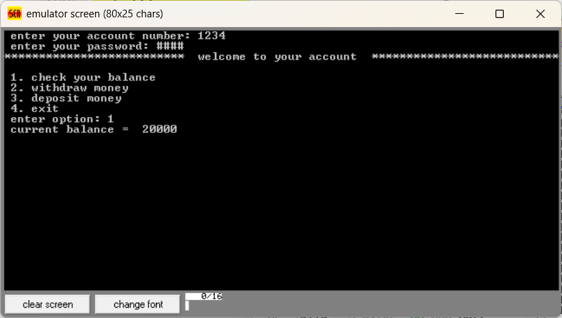
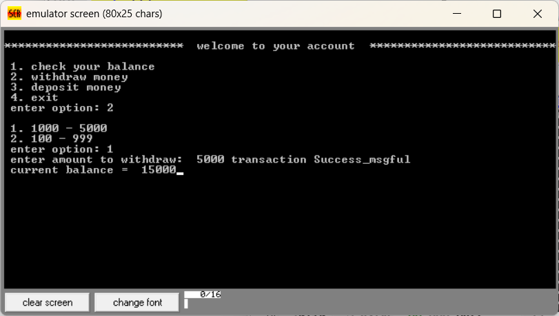
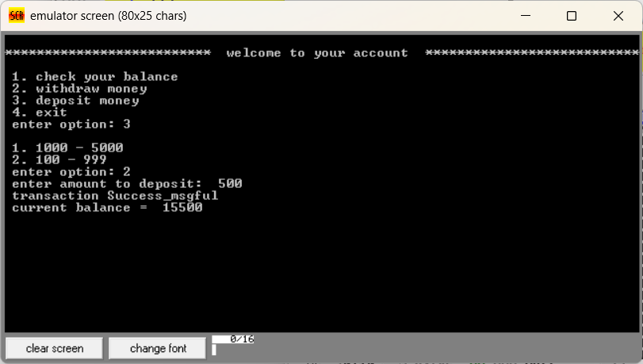
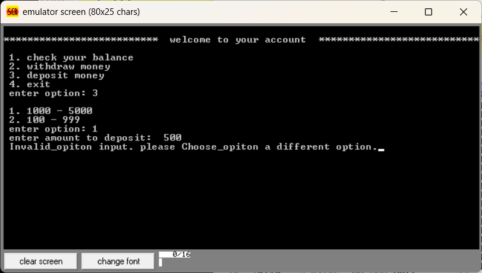
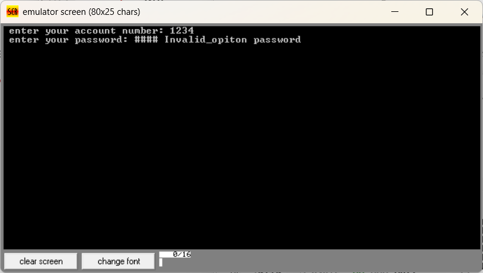

<!DOCTYPE html>
<html lang="en">
<head>
  <meta charset="UTF-8"> 
</head>
<body>

  <h1>💳 ATM System in Assembly Language</h1>

  

    <h2>📘 Overview</h2>
    
This project simulates a basic ATM system using assembly language on the emu8086 emulator. It allows users to perform essential banking operations such as login authentication, balance inquiry, cash withdrawal, deposit, and exit. The project was developed as part of the Microprocessors and Microcontrollers Lab at Green University of Bangladesh.

  

  

    <h2>🎯 Features</h2>
    <ul>
      <li>Secure user authentication using masked PIN input</li>
      <li>Balance inquiry with real-time feedback</li>
      <li>Cash withdrawal with range validation</li>
      <li>Cash deposit with range validation</li>
      <li>Exit process with confirmation message</li>
      <li>Error handling for invalid account, password, and transaction amounts</li>
    </ul>
  

  

    <h2>🛠️ Technology Stack</h2>
    <ul>
      <li><strong>Language:</strong> Assembly (emu8086)</li>
      <li><strong>Platform:</strong> DOS emulator</li>
      <li><strong>Tools:</strong> emu8086 IDE</li>
    </ul>
  

  

    <h2>📂 Project Structure</h2>
    <ul>
      <li><code>ATM v2.1.asm</code> – Main assembly source code</li>
      <li><code>ATM_Micro_Project_Project.pdf</code> – Lab report documentation</li>
    </ul>
  

  

    <h2>🖼️ Screenshots</h2>
    
Sample emulator outputs:

    <ul>
      <li>Login Screen and 1st interface</li>
      
      <li>Balance Inquiry</li>
      
      <li>Withdraw and Deposit Transactions</li>
      
    
      <li>Error Messages for Invalid Inputs</li>
      
      
    </ul>
    <!-- Replace with actual image paths if available -->
    
    
    
  

  

    <h2>🚀 Getting Started</h2>
    <ol>
      <li>Install emu8086 IDE</li>
      <li>Open <code>ATM v2.1.asm</code> in the IDE</li>
      <li>Compile and run the program</li>
      <li>Follow on-screen prompts to simulate ATM operations</li>
    </ol>
  

  

    <h2>📈 Performance Evaluation</h2>
    <ul>
      <li>Modular code structure with clear function separation</li>
      <li>Efficient memory usage and input validation</li>
      <li>Real-time feedback and error handling</li>
    </ul>
  

  

    <h2>⚠️ Limitations</h2>
    <ul>
      <li>Hardcoded credentials and balances</li>
      <li>No graphical interface</li>
      <li>Limited scalability and multi-user support</li>
    </ul>
  

  

    <h2>🔮 Future Enhancements</h2>
    <ul>
      <li>Graphical User Interface (GUI)</li>
      <li>Biometric authentication</li>
      <li>Dynamic data storage using files or databases</li>
      <li>Transaction history logging</li>
      <li>Multi-account support</li>
      <li>Mobile application integration</li>
    </ul>
  

  <!-- 

    <h2>👨‍💻 Authors</h2>
    <table>
      <tr><th>Name</th><th>ID</th></tr>
      <tr><td>Md. Sabbir Hossain</td><td>221902126</td></tr>
      <tr><td>Md. Israil Fakir</td><td>221902125</td></tr>
    </table>
  
 -->

</body>
</html>
